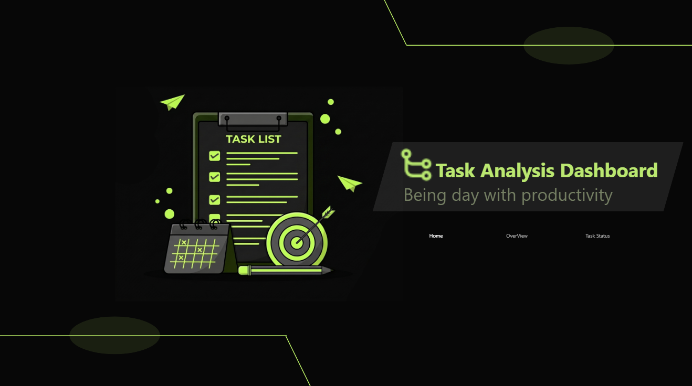
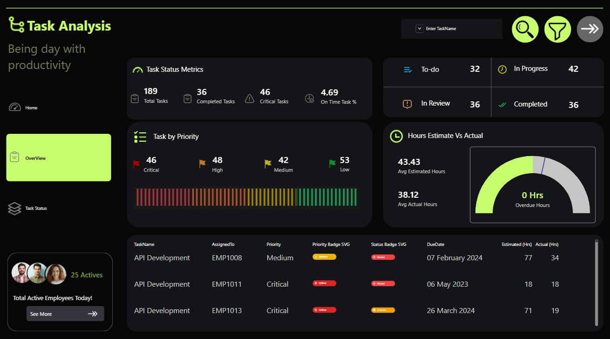
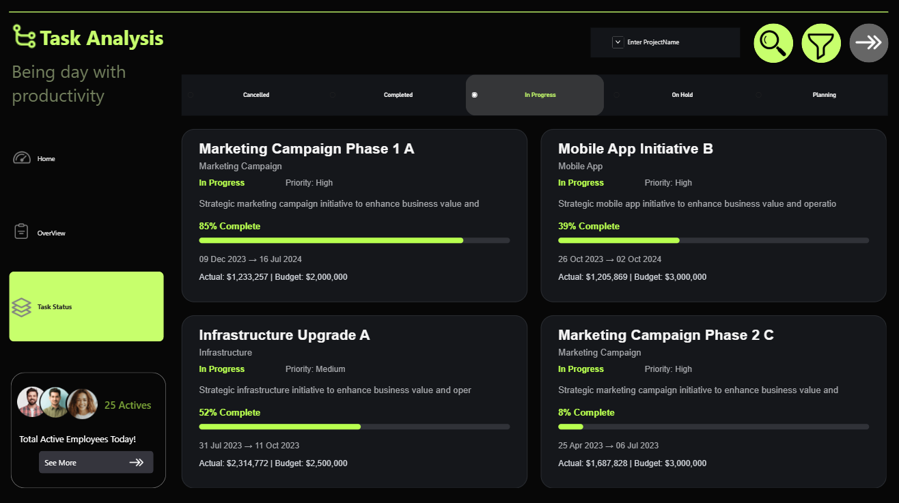

# 📊 Task Analysis Dashboard | Power BI

An interactive **Task Management Dashboard** built with Power BI to analyze task performance, priorities, status, working hours, and overall project progress.

## 📌 Dashboard Pages

### 🏠 Home
Provides the main navigation and dashboard overview.

### 📈 Overview
Provides key task KPIs and analysis including task performance, priorities, status, estimated vs actual hours, and task details.

### 📊 Task Status
Interactive analysis of tasks based on their current status and priority.

## 🛠️ Tools Used

- Power BI
- DAX
- Power Query
- Data Modeling
- Excel

## 📸 Dashboard Preview

### Home

### Overview

### Task Status

## 🎯 Skills Demonstrated

Power BI • DAX • Power Query • Data Modeling • KPI Analysis • Data Visualization • Task Analytics

## 👨‍💻 Author

**Jatin**  
Data Analytics | Power BI | SQL | Excel | Python
